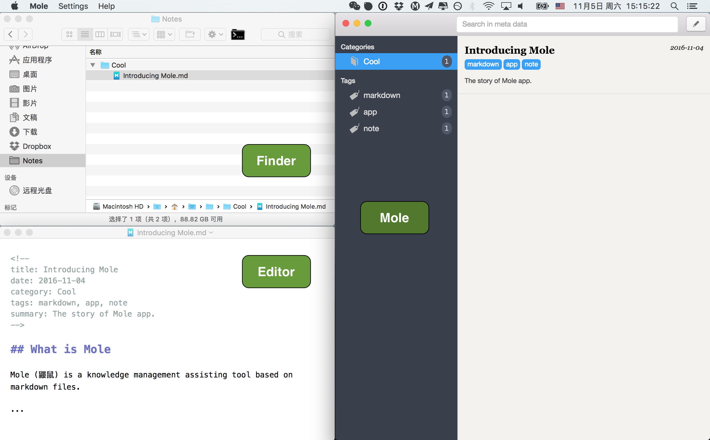

## Latest release

[Download here](https://github.com/herrkaefer/Mole/releases). Only macOS is supported now.

## What is Mole?

Mole (鼹鼠) is a Markdown documents management tool.

## What Mole is not?

- Mole is not another advanced writing app which let you do everything in it, meanwhile, least things outside it.
- Mole is not another beautiful Markdown editor. Mole does not provide any editor along with it. Enjoy your own favourite one.
- Mole does not own your documents. Mole itself is a reader of them. Your texts are in plain Markdown files in the folders on the disk. 
- Mole does not plan to provide much single-document-related functions. Export a doc to pdf or HTML? Your editor must have this function already.
- Mole does not require you to operate documents within it. It just provides alternative approaches. You can definately operate files directly in Finder or with other tools, or even with Mole in parallel. If file is modified, Mole will know it.
- Mole does not force you to add any or specific meta data in your Markdown file, though it is a recommended practice.
- Mole does not care about folders. Only the files are concerned. Category is declared as in the meta data, and is not necessary to be the same with the name of the folder where the file is located.

## Mole is for you if

- You are a Markdown lover. You write with this format for nearly everything except paper love letter (or it could also be a printed Markdown file).
- You have your favourite markdown editor, and it may change as new better ones appear all the time.
- You have tried a lot of methods to manage your writings pieces (tech notes, blog articles, reading summaries, ideas, novels, etc.), including integrated big note taking apps, however after changed a few ones for years (with pain), you still worry:
    - The apps loves to invent their own private file format which can only be interpreted by themselves, so it is never easy to export your articles as you wish, even they do have export function in the menu.
    - The more you write with the app, the more you rely on it. Think about if the app stops updating and becomes useless after 5 years, or Apple computer is outdated and replaced by a new device so the private documents are hard to readout?
    - The editor the app provides is often good, but happens not to be your favourite one.
    - You are tired of transforming all texts to a new app again, however the used one is not satisfying any more.

Finally you realize that there's not an ultimate app for this. You may turn to the simple and stupid method, that is, to create plain text files in folders located on the disk. And strangely, this works, with no pain. 

Let's have a look at how to work this way. In the following, all your documents are called notes for conviences.

-   **Note organization**: notes could be grouped in subfolders with meaningful names which can usually be considered as categories.
-   **Note browsing**: use Finder, it is good enough especially under the columns view. You can switch between subfolders and see the filenames quickly.
-   **Note creation**: Copy an existing file and start to modify it. Or you can write a simple bash script to do this like [this](https://gist.github.com/herrkaefer/8c4b84b07e565d8e2ff5e649e55d8f95)
-   **Note editing**: Use your favourite Markdown editor. It's a pleasure.
-   **Note deleting**: Done in Finder.
-   **Search note files by tags**: You can add tags for files in Finder by hand. But this is not a good way, because these infomation exists outside the texts themselves. You will lose it when you copy the files out or reinstalled system. For a solution, I add some meta data in the text as a front matter, which is explained later.
-   **Search in note contents**: MacOS's spotlight does not index Markdown files by default, and it is not that easy to hack this because the spotlight's configuration file is "restricted" by macOS. Of course it can be done with some terminal commands. But its not friendly to ordinary users.
-   **Quick preview**: Done in Finder. You need to install something to do this. 
-   **Single-document editing related operations**: Done with your editor. e.g. exporting to different format, printing ...
-   **Other demands**: 
    - Sync to cloud: Put the folder in Dropbox
    - Encyption: use tools like [Boxcryptor](https://www.boxcryptor.com/en)
    - Publish a note as Jekyll post: this requires a few steps: copy note to Jekyll's post folder, rename the post file, add / modify some meta data in the front matter ... Done by hand or by a script.

So, the conclusion: This is almost the ultimate solution, though not very efficient for some jobs, and for ordinary users, some jobs are impossible.

Mole provides a mimimal user interface to implement the above operations, and brings convenience and efficiency. 😄


## Meta data in Markdown file

Meta data is a front header in the text where some meta information about the document is recorded. 

If you add a note with Mole, some default meta data will be added in the front of the  newly created file. They are `title`, `date`, `category`, `tags`, and `summary`, and embraced by `<!--` and `-->`, so are recognized as comments. An example:

```markdown
<!--
title: Introducing Mole
date: 2016-11-04
category: Cool
tags: markdown, app, note
summary: The story of Mole app.
-->

## What is Mole

Mole (鼹鼠) is a knowledge management assisting tool based on markdown files.

...
```

The meta datas are extracted and properly displayed by Mole. They are very helpful to get some key infomation about your document. Have a look at the interface, and the three-body relations:



For the format of meta data, there's not a standard defination. I have considered popular ones like Jekyll front matter and multimarkdown, and finally choose to use the comment block, because it is the most **intrusive** approach. It is safe to be included. Any editor should not recognize it as part of the main contents.

However, Mole does not require the user to add meta data, or any specific ones. Actually you can totally ignore it, or add any meta you want. However, even there's no meta exists, Mole will display some helpful infomations for you. The rules are:

- `title`: **filename** if meta does not exist
- `date`: **creation date** if meta does not exist
- `category`: **"Uncategorized"** if meta does not exist
- `tags`: **empty** if meta does note exist
- `summary`: **first a few lines of text** if meta does not exist


## Some notes

- Mole needs you to specify a **root folder** which keeps all your docs. The folder can contain files of any format, and only the Markdown files are recognized and monitored by Mole.
- Supported Mardown file extensions: `md` (default) and `markdown`
- When you add a note by Mole, the new doc will be created under a subfolder with the name of the category by default, i.e. `root/category/title.md` But you can move it as you wish later.
- When you publish doc as Jekyll post, a `published: true` meta item will be appended to the meta data of the orginal doc. The transformed post doc will be placed at the Jekyll project's `_post` folder specified by you, with modified filename and front matter which is ready for publishing.


## Acknowledgement

The app is developed with [Electron](http://electron.atom.io/). CSS is modified based on [Photon](http://photonkit.com/).

The name Mole is from a classic Czech cartoon [Krtek](https://www.wikiwand.com/en/Mole_(Zden%C4%9Bk_Miler_character)) which is loved by my little daughter during my development of this app.


