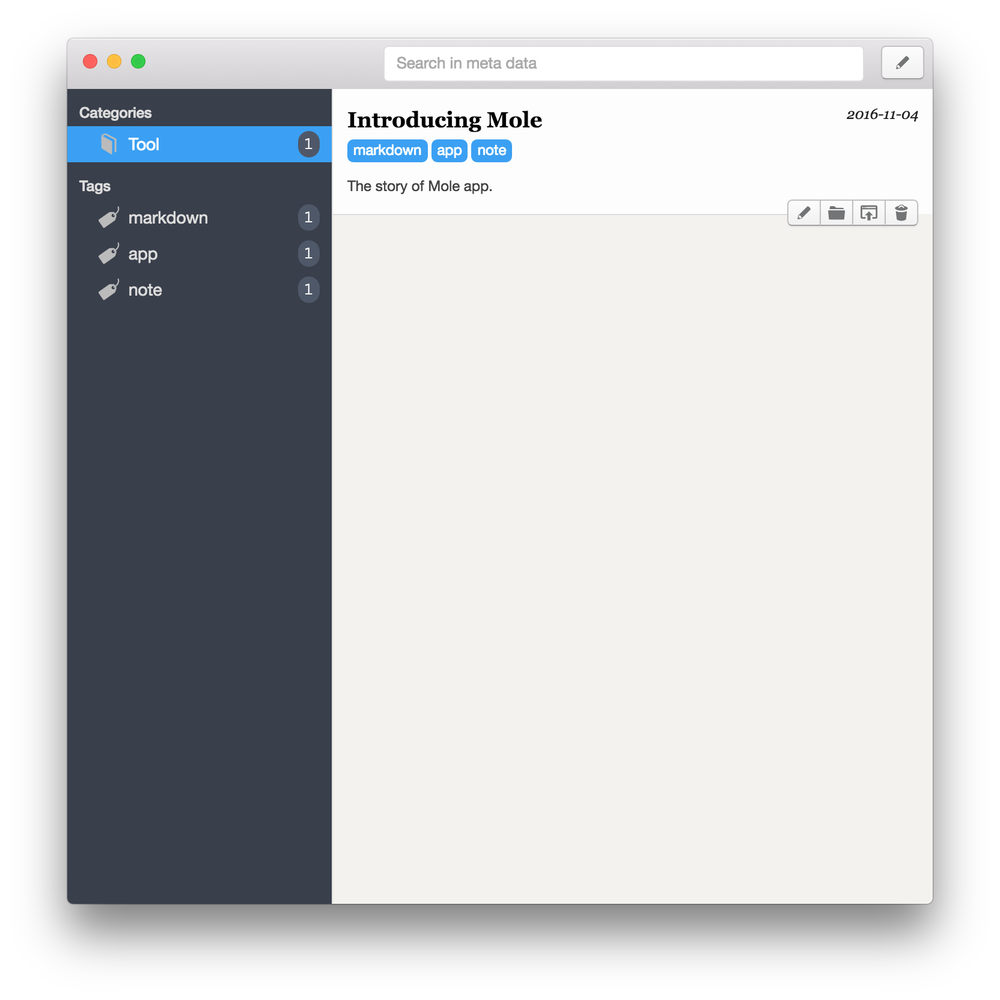

## What is Mole

Mole (鼹鼠) is a knowledge management assisting tool based on markdown files.

Mole is for you if 

- You are Markdown aficionados. You write with Markdown format for nearly everything except paper love letter (or it could also be a printed Markdown file).
- You have your favourite markdown editor, and it may change as new better ones appear all the time.
- You have tried a lot of methods to manage your writings pieces (notes, blog articles, reading summaries, etc.), including integrated (big) note taking apps, however after changed a few ones for years, you still have worries:
    - The apps usually invent their own private file format which can only be interpreted by themselves, so it is never an easy job to export your articles as you wish, even they do have export function in the menu.
    - The more you write with the app, the more you rely on it. Think about if the app stops updating and useless after 5 years, or Apple computer is outdated and replaced by a new device?
    - The editor the app provided is often good, but happens not to be your favourite one.
    - You are tired of transforming all texts to a new app, however the used one is not satisfying any more.

Then you realize that there's not an ultimate app for this. You may turn to the simplest method, like me, to create plain text files in a folder located on the disk. And strangely, this works, with no pain. 

Let's see how to work this way. In the following, all your writing pieces are called notes for conviences.

- **Note organization**: notes could be grouped in subfolders with meaningful names which can usually be considered as categories.
- **Note browsing**: use Finder, it is good enough especially in the columns view. You can switch between subfolders and see the filenames quickly.
- **Note creation**: copy an existing file and start to modify it. Or you can write a simple bash script to do this like [this](https://gist.github.com/herrkaefer/8c4b84b07e565d8e2ff5e649e55d8f95)
- **Note editing**: use your favourite Markdown editor. It's a pleasure.
- **Note deleting**: done in Finder.
- **Search note files by tags**: You can add tags for files in Finder by hand. But this is not a good way, because these infomation exists outside the texts themselves. You will lose it when you copy the files out or reinstalled system. For a solution, I add some meta data in the text as a front matter, which is explained later.
- **Search in note contents**: MacOS's spotlight does not index Markdown files by default, and it is not that easy to hack this because the spotlight's configuration file is "restricted" by macOS. Of course it can be done with some terminal commands.
- **Some other special tasks**: e.g. publish a note as Jekyll post which requires a few steps: copy note to Jekyll's post folder, rename the post file, add / modify some meta data in the front matter ... This also can be done by hand or by some scripts.

So, the conclusion: This is almost the ultimate solution, though not very efficient for some jobs. For ordinary user, some jobs are impossible.

Mole provides a mimimal user interface to make the above things easy and efficient. 😄


## Meta data in Markdown file

If you add a note with Mole, some default meta data will be added to the  newly created file. They are `title`, `date`, `category`, `tags`, and `summary`, and embraced by `<!--` and `-->`, so are recognized as comments. An example:

```markdown
<!--
title: Introducing Mole
date: 2016-11-04
category: Cool
tags: markdown, app, note
summary: The story of Mole app.
-->

## What is Mole

Mole (鼹鼠) is a knowledge management assisting tool based on markdown files.

...
```

The meta datas are extracted by Mole and displyed. They are very helpful  to get the basic infomation about your writing. See the UI:



For the format of meta data, there's not a standard defination. I have considered popular ones like Jekyll front matter and multimarkdown, and finally choose to use the comment block, because it is the most intrusive approach. Any editor should not recognize it as part of the main contents.

Mole does not require the user to add meta data, or require some specific ones. Actually you can totally ignore it, or add any meta you want. However, even there's no meta exists, Mole will display some helpful infomations for you. The rules are:

- title: filename if meta does not exist
- date: creation date if meta does not exist
- category: "Uncategorized" if meta does not exist
- tags: empty if meta does note exist
- summary: first a few lines of text if meta does not exist


## What does not Mole do?

- Mole does not provide any markdown editor inside. Use your own favourite one.
- Mole does not force you to do any jobs with it. It provides alternatives. You can even operate files directly in Finder and in Mole at the same time.
- Mole does not force you to add any or specific meta data in your Markdown file. It is just recommended.

## Latest release

[Download here](https://github.com/herrkaefer/Mole/releases). Only macOS is supported now.


